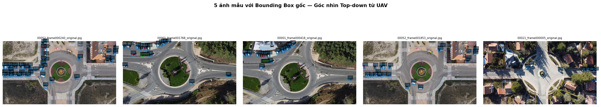
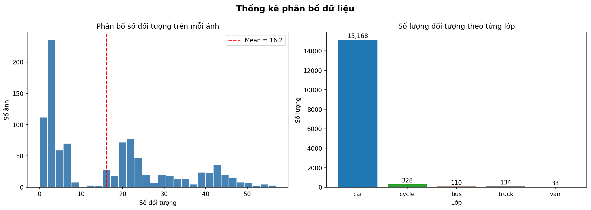
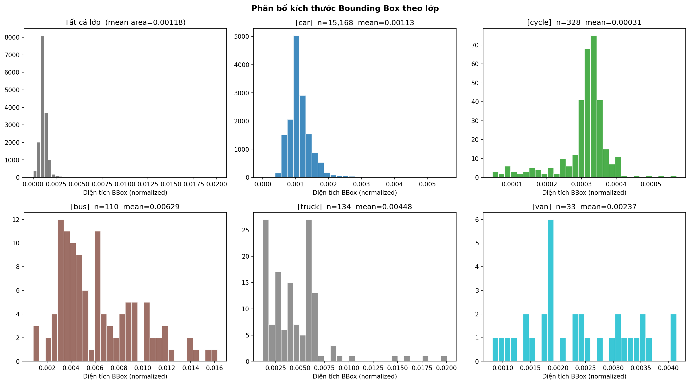
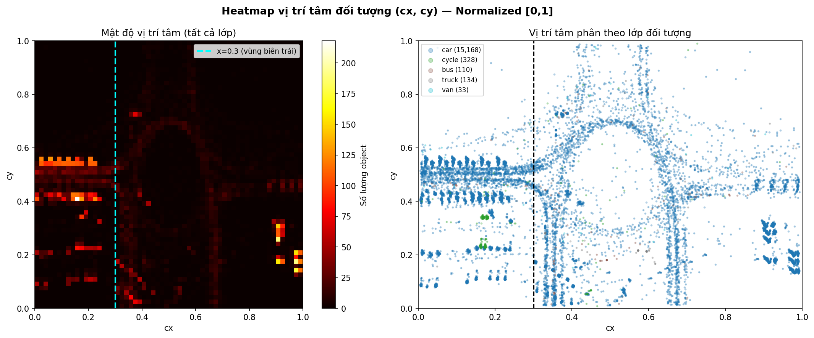
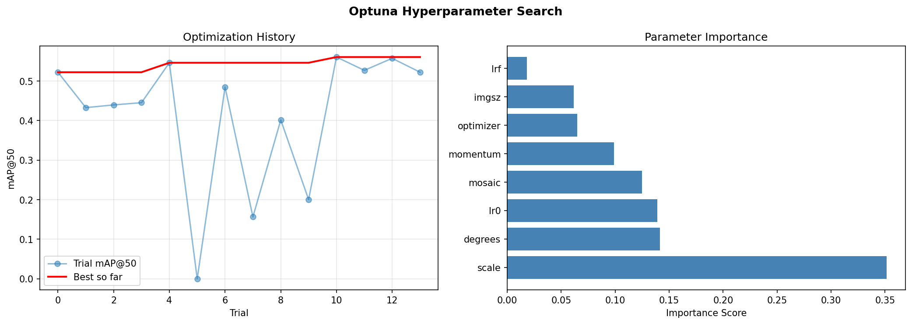
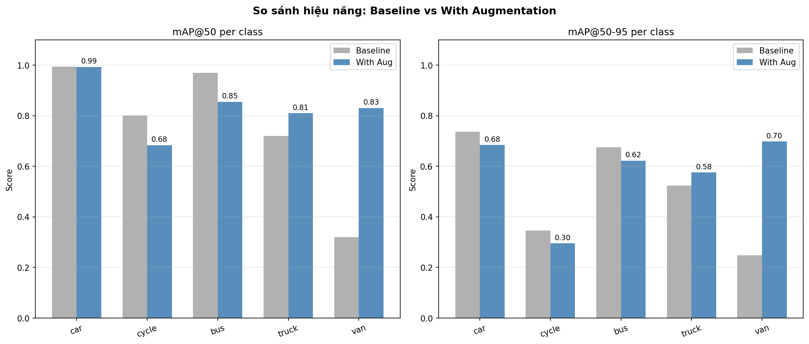
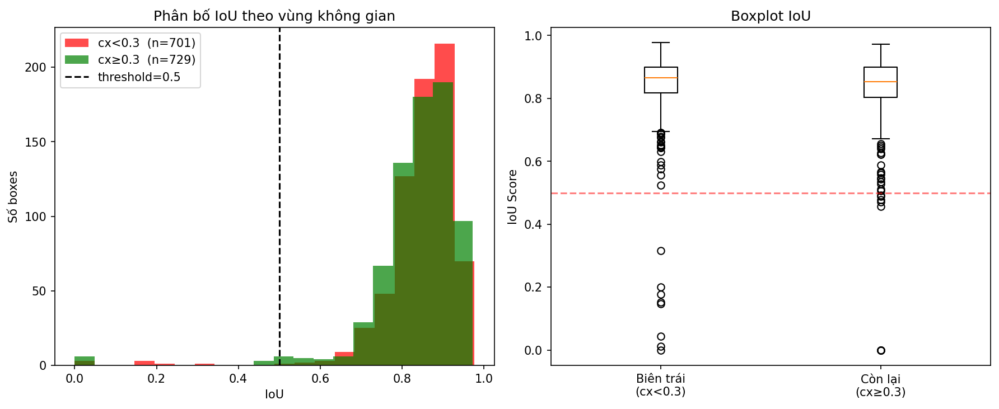

# Roundabout Vehicle Detection — YOLOv11


> Traffic analysis at roundabouts using aerial (UAV) imagery

---

## Overview

This project builds an automated vehicle detection system for aerial images of roundabouts using the **YOLOv11** architecture. The system detects 5 vehicle classes (car, cycle, bus, truck, van) from a top-down UAV perspective.

| Part | Description |
|------|-------------|
| `training/` | Full pipeline: EDA → Augmentation → YOLOv11 training → Evaluation |
| Web App | FastAPI inference demo — upload an image or video and get detections instantly |

---

## Detection Results


*YOLOv11 detecting vehicles at high-density roundabout scenes (45–48 detections per image)*

---

## Data Exploration (EDA)

### Sample Images with Ground-Truth Bounding Boxes

*5 sample aerial images from the Roundabout dataset — top-down UAV view*

### Class Distribution & Label Statistics

*Strong class imbalance: car (15,168) dominates over cycle (328), bus (110), truck (134), van (33). Average 16.2 objects per image.*

### Bounding Box Size Distribution per Class

*Vehicles in aerial imagery are extremely small (mean area ≈ 0.00118 normalized). Cycle is the smallest class (mean ≈ 0.00031), explaining its lower detection accuracy.*

### Spatial Heatmap — Object Center Distribution

*High vehicle density detected near the left edge (x < 0.3), revealing a strong spatial bias in the dataset. This directly informed the augmentation strategy.*

---

## Augmentation Strategy

Based on the heatmap findings, the following geometric transforms were applied to handle vehicle multi-directionality and reduce spatial bias:

| Augmentation | Value | Reason |
|---|---|---|
| `degrees` | 180 | Vehicles travel in all directions around the roundabout |
| `fliplr` | 0.5 | Reduce left/right spatial bias detected in heatmap |
| `flipud` | 0.5 | Handle top-down view vertical symmetry |
| `mosaic` | 1.0 | Increase traffic density variety per image |
| `scale` | 0.5 | Simulate vehicles at different altitudes/distances |

---

## Hyperparameter Tuning — Optuna


*14 trials with Optuna. Best mAP@50 ≈ 0.556. Most impactful parameter: **scale** (importance score 0.35), followed by **degrees** and **lr0**.*

---

## Model Performance

### Per-Class mAP: Baseline vs With Augmentation


| Class | mAP@50 (Baseline) | mAP@50 (Aug) | mAP@50-95 (Baseline) | mAP@50-95 (Aug) |
|-------|:-----------------:|:------------:|:--------------------:|:---------------:|
| car   | 1.00 | **0.99** | 0.73 | 0.68 |
| cycle | 0.80 | 0.68 | 0.35 | 0.30 |
| bus   | 0.97 | **0.85** | 0.67 | 0.62 |
| truck | 0.72 | **0.81** | 0.53 | 0.58 |
| van   | 0.32 | **0.83** | 0.25 | 0.70 |
| **mean** | 0.76 | **0.83** | 0.51 | **0.58** |

> Augmentation significantly improved **van** (+0.51 mAP@50) and **truck** (+0.09), at the cost of a slight drop in **cycle** — consistent with its tiny size and low sample count (328 instances).

### Bounding Box IoU — Spatial Error Analysis

*Left-edge region (cx < 0.3, n=701) shows more low-IoU outliers than the rest of the image (cx ≥ 0.3, n=729), confirming that spatial bias at the boundary increases localization errors.*

---

## Results Summary

| Metric | Value |
|--------|-------|
| mAP@50 (all classes, with aug) | **0.832** |
| mAP@50-95 (all classes, with aug) | **0.576** |
| Best performing class | car (0.99) |
| Weakest class | cycle (0.68) |

---

## Project Structure

```
├── training/
│   └── capstone_roundabout.ipynb   # Full training notebook
├── assets/                          # Images used in this README
├── templates/
│   └── index.html                   # Web UI
├── static/
│   └── results/                     # Generated outputs (not committed)
├── main.py                          # FastAPI server
├── best.pt                          # Trained YOLOv11 weights
├── run.bat                          # Quick start (Windows)
└── requirements.txt
```

---

## Notebook & Dataset

Both the training notebook and dataset are available on Google Drive:

**[Open on Google Drive](https://drive.google.com/drive/folders/1g-m2ngEMykuLrMfbZTnFc4BsxzUUkSWk?usp=sharing)**

> Run `capstone_roundabout.ipynb` on Google Colab (GPU recommended) to reproduce training and generate `best.pt`.

### Dataset structure (after download)
```
dataset/
├── images/
│   ├── train/
│   └── val/
└── labels/
    ├── train/
    └── val/
```

Classes (in label ID order): `car`, `cycle`, `bus`, `truck`, `van`

---

## Run the Web Demo

### Prerequisites
- Python 3.10+
- Git

### Installation

```bash
# 1. Clone the repository
git clone https://github.com/Thanh-Mathieu95/aerial-roundabout-vehicle-detection.git
cd aerial-roundabout-vehicle-detection

# 2. Create virtual environment
python -m venv venv
venv\Scripts\activate      # Windows
# source venv/bin/activate # Linux/Mac

# 3. Install dependencies
pip install -r requirements.txt
```

### Start the server

**Windows** — double-click `run.bat`

or manually:

```bash
uvicorn main:app --reload
```

Open **http://127.0.0.1:8000** in your browser.

Upload an image (JPG, PNG, WEBP) or video (MP4, AVI, MOV, MKV) → click **Detect** → view bounding boxes and confidence scores.

---

## Tech Stack

- [YOLOv11](https://github.com/ultralytics/ultralytics) — Object Detection
- [FastAPI](https://fastapi.tiangolo.com/) — Web Backend
- [OpenCV](https://opencv.org/) — Image Processing
- [Optuna](https://optuna.org/) — Hyperparameter Tuning
- Google Colab — GPU Training

---

## Author

**Nguyen Duong Cong Thanh**  
Machine and Deep Learning 03 · March 2026
